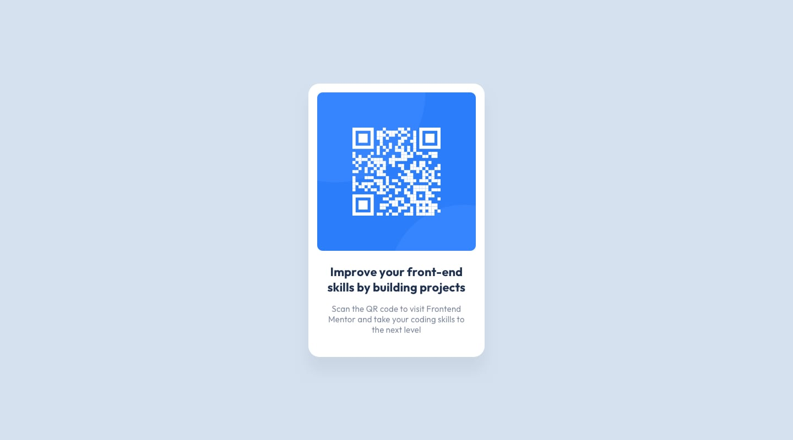

# Frontend Mentor - QR code component solution

This is a solution to the [QR code component challenge on Frontend Mentor](https://www.frontendmentor.io/challenges/qr-code-component-iux_sIO_H). Frontend Mentor challenges help you improve your coding skills by building realistic projects.

## Table of contents

-   [Overview](#overview)
    -   [Screenshot](#screenshot)
    -   [Links](#links)
    -   [Built with](#built-with)
-   [Author](#author)

## Overview

### Screenshot

### Links

-   Solution URL: [Github code source](https://github.com/steeven509/qr-code-component)
-   Live Site URL: [Website](https://qr-code-component-by-steevencode.netlify.app/)

## Author

-   Frontend Mentor - [@steeven509](https://www.frontendmentor.io/profile/steeven509)

## Acknowledgments

This is where you can give a hat tip to anyone who helped you out on this project. Perhaps you worked in a team or got some inspiration from someone else's solution. This is the perfect place to give them some credit.
